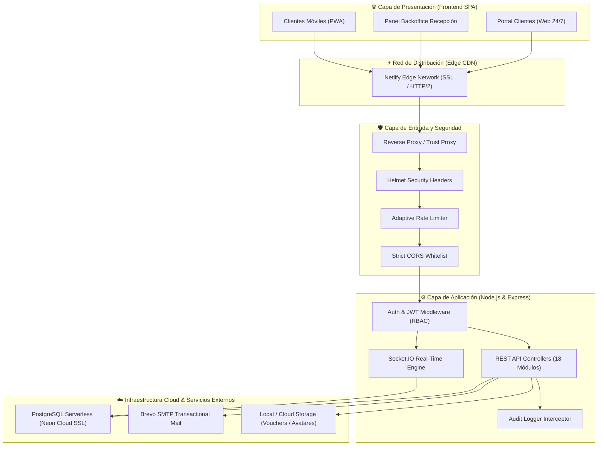
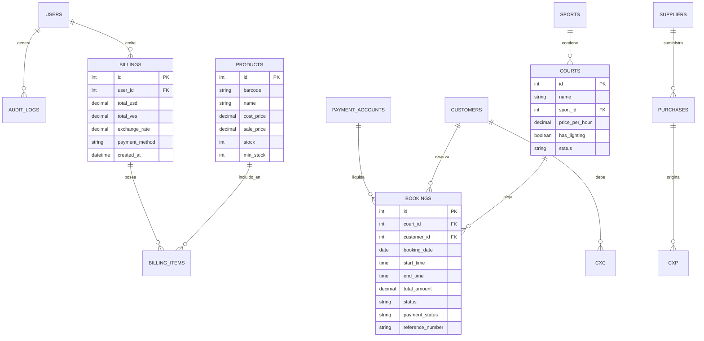

# 🛡️ CourtManager — Whitepaper de Arquitectura, Seguridad e Infraestructura Cloud

> **Documento Técnico de Arquitectura Empresarial, Topología Cloud y Seguridad de la Información.**  
> *Versión 2.0 Commercial Edition | Dirigido a Directores de Tecnología (CTO), Ingenieros de Seguridad, Auditores y Desarrolladores.*

---

## 1. Visión General de la Arquitectura

**CourtManager** está diseñado bajo los principios de una arquitectura desacoplada moderna (*Single Page Application + API RESTful sin estado + Motor WebSockets Bidireccional*), priorizando alta disponibilidad, tiempos de respuesta ultra bajos (&lt;50ms en red local) y sincronización de datos en tiempo real entre múltiples terminales concurrentes.



---

## 2. Componentes del Ecosistema

### 2.1. Frontend SPA (Single Page Application)
- **Tecnología:** React 19, Vite, TypeScript/JavaScript moderno, Tailwind CSS, Lucide Icons y componentes Shadcn UI.
- **Rendimiento:** Compilación estática optimizada con *Code Splitting* y carga perezosa (*Lazy Loading*). El tiempo de primera pintura con contenido (FCP) es inferior a **0.8 segundos**.
- **Distribución:** Servido a través de CDN de escala global con compresión Brotli/Gzip y certificados SSL/TLS automáticos con renovación continua.

### 2.2. Backend & API Core
- **Tecnología:** Node.js v20+ LTS con Express.js.
- **Mecanismo de Ejecución:** Servidor HTTP no bloqueante con *Event Loop* asíncrono para manejar cientos de conexiones concurrentes de reservas y ventas simultáneas.
- **Middleware de Optimización:**
  - `compression`: Reduce el payload de transferencias JSON hasta un 70%.
  - `morgan`: Registro estructurado de accesos HTTP con formato *combined*.
  - `cookie-parser`: Manejo seguro de tokens de sesión y cookies `HttpOnly`.

### 2.3. Motor de Tiempo Real (WebSockets con Socket.IO)
- **Protocolo:** WebSocket nativo con fallback automático a HTTP Long-Polling.
- **Canales y Salas Segmentadas:**
  - `dashboard`: Canal reservado para pantallas de recepción y administración. Recibe alertas instantáneas de nuevas reservas web, cancelaciones y stock bajo.
  - `customer-${id}`: Salas aisladas y privadas para que cada cliente reciba únicamente notificaciones relacionadas con su cuenta.
- **Latencia:** Notificaciones y bloqueo visual de canchas en menos de **50 milisegundos**.

### 2.4. Persistencia Cloud (Neon PostgreSQL)
- **Motor:** PostgreSQL 16 Serverless alojado en Neon Cloud.
- **Conectividad:** Conexiones cifradas mediante `pg-pool` con SSL obligatorio (`ssl: { rejectUnauthorized: false }`).
- **Escalabilidad:** Separación de cómputo y almacenamiento que escala automáticamente ante picos de demanda (fines de semana, torneos) y reduce costos en horarios nocturnos.

---

## 3. Modelo de Entidades y Datos (ERD Simplificado)

El modelo relacional garantiza integridad referencial estricta mediante claves foráneas y restricciones `ON DELETE RESTRICT` en registros contables:



---

## 4. Arquitectura de Seguridad y Protección de Datos

CourtManager implementa seguridad por diseño (*Security by Design*) en todas las capas del sistema:

### 4.1. Autenticación y Criptografía
- **JSON Web Tokens (JWT):** Autenticación sin estado. El payload contiene únicamente identificadores no sensibles (`userId`, `role`, `email`).
- **Hashing de Contraseñas:** Algoritmo unidireccional **bcrypt** con factor de coste de 10 rondas de salt. Ninguna contraseña se almacena jamás en texto plano.
- **Expiración de Sesión:** Tokens configurables con tiempo de vida limitado para minimizar la ventana de exposición.

### 4.2. Control de Acceso Basado en Roles (RBAC)
Middleware de autorización estricta en cada ruta de la API:
- `requireRole(['admin'])`: Protegido exclusivamente para la alta gerencia. Acceso a reportes de margen comercial, auditoría de logs, creación de usuarios y borrado de registros.
- `requireRole(['admin', 'operator'])`: Acceso operacional a cuadrante de turnos, apertura/cierre de caja, facturación POS y consulta de disponibilidad.

### 4.3. Prevención de Ataques Web Comunes
1. **Inyección SQL:** Todas las consultas a la base de datos se ejecutan mediante *Sentencias Preparadas Parametrizadas* (`$1, $2, $3`). No existe concatenación de cadenas directas en cláusulas SQL.
2. **Denegación de Servicio (DDoS / Brute Force):**
   - `express-rate-limit` activo en todas las rutas bajo `/api`.
   - Límite de 100 peticiones por ventana de 15 minutos por dirección IP.
   - Limitador reforzado en `/api/auth/login` para prevenir ataques de fuerza bruta en contraseñas.
3. **Cross-Origin Resource Sharing (CORS):** Lista blanca estricta con orígenes autorizados. Se rechazan peticiones con cabeceras `Origin` no registradas.
4. **Cabeceras HTTP Seguras con Helmet:**
   - `X-Frame-Options: SAMEORIGIN` (prevención de Clickjacking).
   - `X-Content-Type-Options: nosniff` (prevención de MIME-sniffing).
   - `Cross-Origin-Resource-Policy: cross-origin` para recursos estáticos autorizados.

### 4.4. Trazabilidad y Auditoría Inmutable
El sistema cuenta con un interceptor que registra automáticamente en la tabla `audit_logs` cualquier evento relevante:
- Inicio y cierre de sesión.
- Creación, modificación o anulación de reservas.
- Facturación en el POS y cambios manuales de stock.
- Modificación de la tasa de cambio oficial.
- Cada registro almacena: `ID de Usuario`, `Acción`, `Entidad Afectada`, `Payload Previo/Nuevo`, `Dirección IP` y `Marca de Tiempo ISO`.
- **Inmutabilidad:** La tabla de auditoría carece de endpoints de actualización o eliminación en la API.

---

## 5. Algoritmo de Bloqueo Concurrente Anti-Overbooking

El mayor riesgo en un centro deportivo es que dos clientes (uno en el portal web y otro en la recepción física) reserven la misma cancha y hora al mismo milisegundo:

```
Paso 1: Cliente A inicia reserva en Cancha 1 (18:00 - 19:00).
Paso 2: La API abre una TRANSACCIÓN SQL con nivel de aislamiento READ COMMITTED.
Paso 3: Verifica solapamiento temporal:
        WHERE court_id = $1 
          AND booking_date = $2 
          AND status != 'cancelled'
          AND (start_time < $end AND end_time > $start)
          FOR UPDATE; -- Bloqueo de fila
Paso 4: Si existe solapamiento -> ROLLBACK inmediato y error HTTP 409 Conflict.
Paso 5: Si está libre -> INSERT en bookings con estado 'confirmed' / 'pending'.
Paso 6: COMMIT de la transacción.
Paso 7: Emisión de evento WebSocket 'booking:created' a todos los dashboards conectados.
Paso 8: En <50ms el turno aparece visualmente bloqueado en todas las pantallas.
```

---

## 6. Políticas de Respaldo, Continuidad y Recuperación ante Desastres (DRP)

| Dimensión | Estrategia Implementada | Tiempo de Recuperación |
| :--- | :--- | :--- |
| **Respaldo de Base de Datos** | Snapshots continuos y Point-in-Time Recovery (PITR) nativos en Neon Cloud. | RPO: &lt; 5 minutos |
| **Recuperación ante Desastres** | Re-aprovisionamiento automatizado mediante infraestructura declarativa. | RTO: &lt; 30 minutos |
| **Cifrado de Datos** | TLS 1.3 en tránsito con certificados RSA de 2048 bits. AES-256 en reposo en almacenamiento cloud. | Continuo |
| **Disponibilidad de Servicio (SLA)** | 99.9% de uptime garantizado con tolerancia a fallos por zona de disponibilidad. | &lt; 0.1% downtime |
