# 🏟️ CourtManager — Ficha Técnica Comercial y Propuesta de Valor

> **Plataforma Integral de Gestión Inteligente, Reservas en Tiempo Real y Control Financiero para Centros Deportivos.**  
> *Versión del Producto: v2.0 Commercial Edition | Diseñado para Escalar Negocios Deportivos.*

---

## 1. Resumen Ejecutivo y Propuesta de Valor

**CourtManager** es una solución digital de alto rendimiento (SaaS / Web App) diseñada específicamente para la administración, automatización y monetización de complejos deportivos modernos (*clubes de pádel, canchas de fútbol 5/7/11, canchas de tenis, básquetbol y polideportivos*).

CourtManager unifica en un solo ecosistema el **portal público de reservas para clientes (24/7)** con un **panel administrativo de control total**: gestión de turnos en vivo, punto de venta (POS), control de inventario con cálculo de margen de ganancia, cuentas por cobrar/pagar, motor multimoneda con tasa del día y reportes de rentabilidad en tiempo real.

```mermaid
flowchart LR
    subgraph Clientes ["📱 Portal Clientes (Web 24/7)"]
        direction TB
        C1["Catálogo de Canchas"]
        C2["Selección de Turno"]
        C3["Checkout Multimoneda (USD/Bs/COP)"]
        C4["Confirmación Automática por Email"]
    end

    subgraph Core ["☁️ Cloud Core en Tiempo Real"]
        direction TB
        S1["API REST Node.js & Express"]
        S2["Sincronización WebSockets (Socket.IO)"]
        S3["Base de Datos PostgreSQL (Neon Cloud)"]
    end

    subgraph Admin ["💻 Panel de Control Administrativo"]
        direction TB
        A1["Cuadrante de Reservas en Vivo"]
        A2["Punto de Venta (POS) e Inventario"]
        A3["Cálculo de Ganancia Neta y Márgenes"]
        A4["Finanzas (CxC, CxP) y Auditoría"]
    end

    Clientes <===>|"Reservas, Comprobantes y Notificaciones"| Core
    Core <===>|"Bloqueo en Tiempo Real y Métricas"| Admin
```

---

## 2. El Problema del Mercado vs. La Solución CourtManager

Los centros deportivos pierden anualmente entre un **15% y 25% de sus ingresos potenciales** debido a métodos tradicionales y manuales de gestión:

| Desafío Tradicional (Cuadernos / WhatsApp / Excel) | Solución Inteligente CourtManager |
| :--- | :--- |
| **Pérdida de clientes fuera de horario:** El cliente quiere reservar de noche o fin de semana y nadie atiende el teléfono. | **Autoservicio 24/7:** Website pública donde el cliente consulta horarios libres, reserva y adjunta su pago al instante. |
| **Conflictos de turnos (Overbooking):** Reservas duplicadas por falta de sincronización entre recepcionistas. | **Sincronización en tiempo real:** Bloqueo automático de turnos mediante WebSockets en cuanto se aparta una hora. |
| **Descontrol en la cantina / tienda:** Fugas de inventario, productos vendidos sin registrar y desconocimiento del margen real. | **POS Integrado con Margen en Vivo:** Descuenta stock automáticamente y calcula costo unitario vs. ganancia neta. |
| **Complicación con pagos en múltiples monedas:** Cobrar en Dólares, Bolívares o Pesos genera errores en el cambio del día. | **Motor Multimoneda Nativo:** Muestra y calcula automáticamente la equivalencia exacta según la tasa oficial guardada. |
| **Falta de visibilidad financiera:** El dueño sabe cuánto cobró, pero no cuánto ganó realmente tras descontar gastos. | **Reportes de Utilidad Neta:** Informes con desglose de Ingresos, Costo de Ventas, Margen % y Utilidad Neta real. |
| **Falta de seguridad interna:** Anulaciones o cobros sospechosos sin responsable visible. | **Auditoría Inmutable:** Registro de cada acción por usuario, fecha, hora, rol e IP. |

---

## 3. Módulos Principales del Ecosistema

### 3.1. Portal Web de Reservas para Clientes *(Website Público)*
- **Catálogo de Canchas y Deportes:** Presentación visual con fotos, superficie, tipo de deporte, iluminación y precio por hora.
- **Selector Inteligente de Horarios:** Calendario dinámico que solo muestra turnos 100% disponibles, previniendo solapamientos.
- **Checkout Multimoneda:** El usuario visualiza el monto tanto en USD ($) como en moneda local (Bs. / COP) con las cuentas bancarias de la empresa (Pago Móvil, Zelle, Transferencia).
- **Carga de Comprobante:** Permite al cliente registrar el número de referencia y adjuntar capture de pago.
- **Notificaciones Transaccionales:** Envío automático de confirmaciones por correo electrónico mediante servidor SMTP (Brevo).

### 3.2. Panel de Recepción y Control Administrativo *(Dashboard)*
- **Métricas en Vivo:** Reservas del día, facturación mensual, porcentaje de ocupación, clientes activos y alertas de stock bajo.
- **Píldora de Tasa de Cambio en Header:** Muestra la tasa referencial activa (`1$ = Bs. 852,41`) con desglose histórico al hacer clic.
- **Centro de Notificaciones en Vivo:** Alertas sonoras y visuales cuando entra una nueva reserva web o se agota un producto.
- **Diseño Adaptable (Responsive):** Totalmente optimizado para computadoras de escritorio, laptops (13"-15"), tablets y smartphones.

### 3.3. Punto de Venta (POS) y Control de Inventarios
- **Venta de Mostrador:** Venta rápida de bebidas, snacks, alquiler de implementos (balones, raquetas) y accesorios deportivos.
- **Cálculo Automático de Rentabilidad:** Cada producto tiene registrado su `cost_price` y `sale_price`. Al vender, el sistema registra el costo histórico y la ganancia neta generada.
- **Alertas de Reorden:** Notificación visual cuando un producto alcanza su stock mínimo de seguridad.
- **Múltiples Métodos de Cobro:** Efectivo, Pago Móvil, Punto de Venta, Transferencia o Cargo a Cuenta Corriente (Crédito).

### 3.4. Motor Multimoneda y Tasas de Cambio
- **Moneda Base Fija:** Dólar Estadounidense (USD) como estándar contable contra la inflación.
- **Monedas Secundarias Flexibles:** Bolívares (VES), Pesos Colombianos (COP) y configuración para cualquier otra divisa.
- **Actualización Instantánea:** Al cambiar la tasa en el panel de configuración, todo el sistema (precios de canchas, productos y website) se actualiza de inmediato sin reiniciar.

### 3.5. Módulo Financiero Integral (CxC, CxP y Compras)
- **Cuentas por Cobrar (CxC):** Registro de saldos pendientes y créditos otorgados a clientes frecuentes con historial de abonos.
- **Gestión de Proveedores y Compras:** Registro de facturas de compra de mercancía que actualiza el inventario y recalcula los costos promedio ponderados.
- **Cuentas por Pagar (CxP):** Control de deudas con proveedores, fechas de vencimiento y programación de pagos parciales.

### 3.6. Informes Gerenciales y Análisis de Rentabilidad *(P&L)*
- **Filtros por Periodo:** Hoy, 7 días, 30 días, Este mes, Mes pasado o rango de fechas personalizado.
- **Métricas de Rentabilidad:**
  - Facturación Bruta (Canchas vs. Productos).
  - Ganancia Neta en Productos (`Ingresos - Costos`) y % de Margen comercial.
  - Ganancia Bruta Operativa.
  - Utilidad Neta Real descontando Compras y Gastos del periodo.
- **Ocupación por Cancha:** Análisis de horas valle vs. horas pico para diseñar promociones en horarios de baja demanda.
- **Exportación e Impresión:** Generación con un clic de informes limpios listos para imprimir o guardar en PDF.

### 3.7. Seguridad, Roles y Trazabilidad (Auditoría)
- **Control de Acceso Basado en Roles (RBAC):**
  - *Administrador / Dueño:* Acceso total a finanzas, costos, reportes, usuarios y auditoría.
  - *Operador / Recepcionista / Cajero:* Gestión de turnos, confirmación de pagos y cobro en mostrador (sin acceso a métricas confidenciales de ganancias).
- **Bitácora de Auditoría:** Registro de cada inicio de sesión, creación de reservas, anulaciones y cambios de tasas con usuario, timestamp y dirección IP.

---

## 4. Retorno de Inversión (ROI) para el Cliente Comercial

Implementar CourtManager genera un retorno financiero medible desde el primer mes:

| Factor de Ganancia | Impacto en el Negocio | Estimación de Ahorro / Ingreso |
| :--- | :--- | :--- |
| **Turnos nocturnos y de autoservicio** | Clientes que reservan 24/7 sin depender de que alguien conteste el teléfono. | **+15% a +25%** en reservas adicionales. |
| **Eliminación de No-Shows (Inasistencias)** | Exigencia de abono o pago previo antes de bloquear la cancha en el sistema. | Reducción del **90%** en canchas desocupadas a última hora. |
| **Control de Fugas en Cantina** | Cada botella de agua o alquiler de balón debe facturarse para descontar inventario. | Ahorro de **$150 - $400/mes** en pérdidas no registradas. |
| **Ahorro de Tiempo Administrativo** | Generación de reportes de ventas, cobros y nómina en 1 clic en vez de horas de Excel. | **~20 horas/mes** de tiempo gerencial recuperado. |

---

## 5. Especificaciones Técnicas y Despliegue

- **Tipo de Aplicación:** Web Application (SaaS / Cloud Native).
- **Frontend:** React 19, Tailwind CSS, Componentes Shadcn UI, Vite Bundler.
- **Backend:** Node.js con Express, arquitectura desacoplada RESTful + WebSockets (Socket.IO).
- **Base de Datos:** PostgreSQL Serverless en la nube (Neon.tech) con alta disponibilidad, backups automáticos y escalado elástico.
- **Servicios Conectados:** Brevo Transactional Email Service, Netlify CDN edge network.
- **Compatibilidad de Dispositivos:** Compatible con Google Chrome, Safari, Microsoft Edge, Firefox en Windows, macOS, Android y iOS (sin necesidad de instalar programas locales pesados).

---

## 6. Modelos de Monetización y Comercialización Sugeridos

Para salir al mercado, CourtManager puede paquetizarse bajo dos modelos de venta:

### Modelo A: Suscripción Mensual / Anual (SaaS)
*Ideal para ingresos recurrentes predecibles.*
- **Plan Básico (1 a 2 canchas):** Gestión de reservas + Website pública + Reportes básicos.
- **Plan Pro (3 a 6 canchas):** Todo lo anterior + POS e Inventario con cálculo de margen + Cuentas por Cobrar/Pagar + Multimoneda.
- **Plan Enterprise (Complejos Grandes / Franquicias):** Múltiples sedes, auditoría avanzada, soporte prioritario y personalización de marca.

### Modelo B: Licenciamiento Único / Compra de Software
- Pago único por instalación y puesta en marcha en la infraestructura del cliente + cuota anual de mantenimiento, actualizaciones y soporte técnico.

---

## 7. Oportunidades y Roadmap de Expansión Comercial

- [ ] **Módulo WhatsApp Automation:** Envío de recordatorio de turno y confirmación directa al WhatsApp del cliente mediante API oficial.
- [ ] **Pasarelas de Pago Automatizadas:** Integración con Stripe, MercadoPago y Binance Pay (cripto) para acreditación inmediata de turnos.
- [ ] **Torneos y Ligas Deportivas:** Módulo adicional para organizar torneos internos, llaves eliminatorias y tablas de posiciones.
- [ ] **Acceso con Código QR / Torniquetes:** Generación de pase QR al reservar para apertura automática de puertas de la cancha.

---

*Documento confidencial preparado para la comercialización y despliegue del producto CourtManager.*  
*Derechos Reservados © 2026 CourtManager Tech Solutions.*
